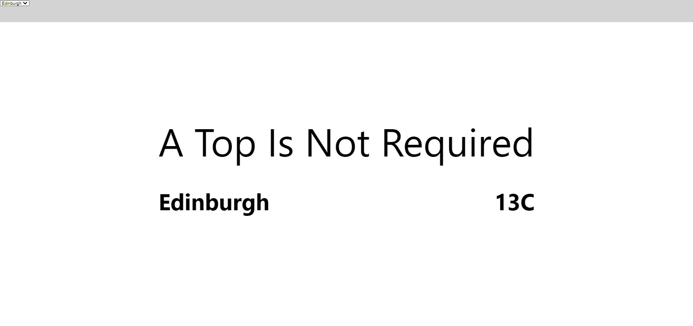

# Weather App

## Introduction

This is a SPA which tells you whether or not you should wear a top depending on the temperature. This is based on the location that you select. This is a great app to make sure that you're never cold again.

## Project Status

This project is at the beginning of it's development. The basic requirements of the client have been met however this app has been built with the with future development in mind.

## Installation

### Requirements

- You will need `node` and `npm` installed globally on your machine

To install and run this application:

1. Clone down this repository.
1. From the inital folder `cd weather-app`
1. Do an npm install `npm install`
1. Run server with `npm start`
1. The app should be running locally now on `localhost:3000`

## Reflections

This project took around 2.5 hours excluding commenting and writing the readme.

If I had more time I would have spent more time on writing tests. I setup the sturucture of how I would like it to be.

I also had more ideas for how to expand the app such as introducing real live weather data from an API.

The Application was built with the use of an API in mind for the future or any sources for data.
